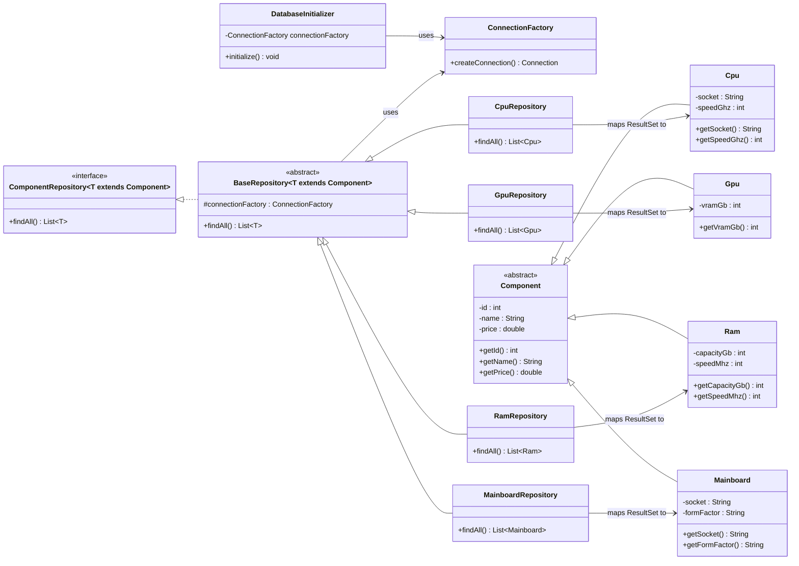

# UML – Datenbankarchitektur und Verbindung (SQLite)

## Hinweis
- `ComponentRepository` definiert den Vertrag, `BaseRepository` liefert gemeinsame Infrastruktur.
- `ConnectionFactory` und `DatabaseInitializer` sind die gemeinsame DB-Infrastruktur.